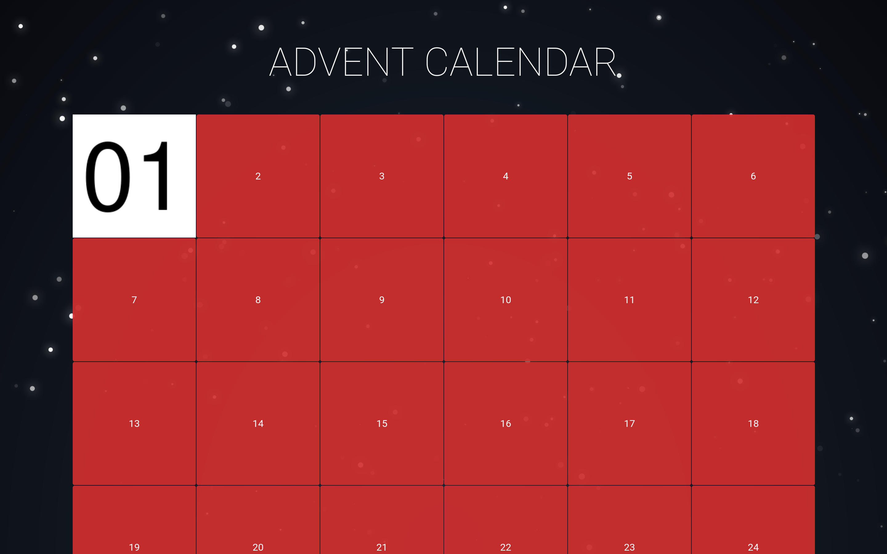

# Advent Calendar

This is a simple web based advent calendar with a pretty snow animation. Each
day a new door may be opened.



## Demo

Have a look at the demo app at https://advent-calendar-green.vercel.app/?day=2.
Note that it has `VITE_OVERRIDABLE_DAY=true` set in order to allow the query
param `day=`. In "normal" production mode only the actual days 1-24 of December
are considered.

## How to use

1. Clone the repository
2. Replace the images `lib/images/{01..24}.png`
3. Optional: Overwrite the title by either
   1. setting an environment variable `VITE_APP_TITLE`
   2. setting the value in `.env.*` (see [Vite env
      variables](https://vitejs.dev/guide/env-and-mode.html#env-files) for
      details)
4. [Build and deploy](#building)

## Development

```bash
npm run dev

# or start the server and open the app in a new browser tab
npm run dev -- --open
```

In development mode the url param `day=` may be set to mock the current day.
This makes it easier to test the images ahead of time.
To enable this in production as well the environment variable
`VITE_OVERRIDABLE_DAY=true` may be set.

## Building

To create a production version of your app:

```bash
npm run build
```

You can preview the production build with `npm run preview`.

To deploy your app, you may need to install an
[adapter](https://kit.svelte.dev/docs/adapters) for your target environment.
